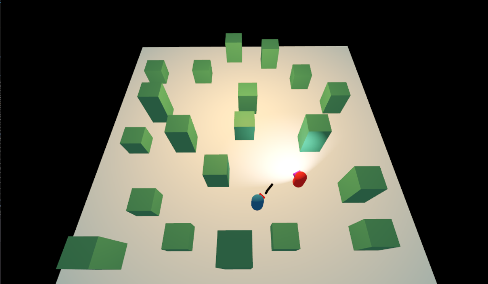

# Godot Third Person Shooting Game 3D

Me trying to make 3D game in godot

## Contributing

Contributors are welcome!

If you encounter a bug, please [open an issue](https://github.com/gxhamster/Godot-Basic-Shooting-Game-3D/issues/new).

If you want to contribute to the project, for instance by fixing a bug or adding a feature, check out our:

1. [GDScript style guide](https://www.gdquest.com/docs/guidelines/best-practices/godot-gdscript/)

## Checkout and Download the Godot Game Engine
[Godot Engine](https://godotengine.org/)
